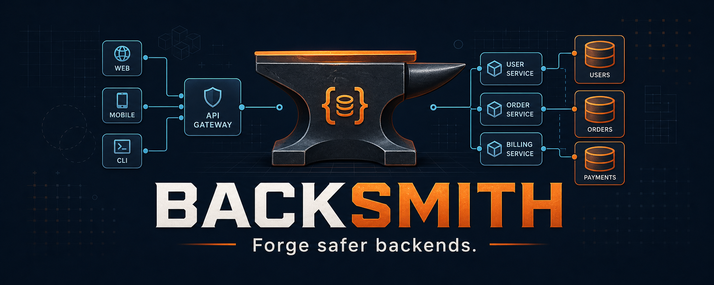
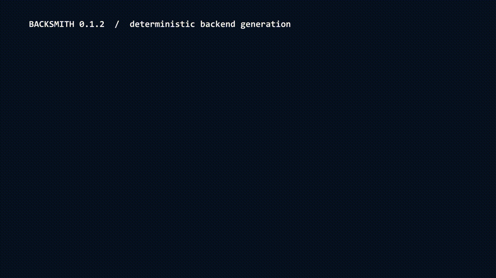

<p align="center">
  
</p>

<p align="center">
  <a href="https://github.com/SanketKudale/backsmith/actions/workflows/build.yml"></a>
  <a href="https://github.com/SanketKudale/backsmith/releases/latest"></a>
  <a href="LICENSE"></a>
  
  <a href="https://github.com/SanketKudale/backsmith/releases"></a>
</p>

<p align="center">
  <strong>A deterministic, conflict-aware CLI for forging safer Spring Boot backends.</strong><br>
  <a href="https://sanketkudale.github.io/backsmith/">Website</a> ·
  <a href="https://github.com/SanketKudale/backsmith/releases/latest">Download</a> ·
  <a href="docs/command-reference.md">Commands</a> ·
  <a href="docs/architecture.md">Architecture</a>
</p>

Backsmith 1.0 is a free, open-source Java 21 CLI for deterministic, conflict-aware production backend generation. It creates Spring Boot 3.5 applications with explicit architecture, security, data, messaging, observability, testing, and deployment choices.

> Generated software is a reviewed starting point, not a compliance certificate. Validate secrets, threat models, retention, capacity, and deployment policy for your environment.

## See it in action

<p align="center">
  
</p>

## Production capabilities

- Maven multi-module CLI built with Picocli
- immutable configuration persisted as `backsmith.yaml`
- deterministic two-phase plan/apply generation
- dry-run, conflict detection, explicit force, skip-existing, JSON, and quiet output
- normalized paths, traversal protection, stable LF output, transactional writes, and rollback
- versioned per-file ownership hashes, history, module metadata, and API-contract metadata
- Spring Boot 3 / Java 21 starter generation
- layered, hexagonal, modular-monolith, clean, onion, CQRS, and microservice layouts
- PostgreSQL, MySQL, MariaDB, SQL Server, Oracle, H2, and MongoDB generation
- JPA/Flyway for relational databases, Spring Data MongoDB for document persistence, validation, Problem Details, idempotency, and audit logging
- basic, session, JWT, OAuth2/OIDC resource-server security, plus a persistent JWT authentication starter
- Spring Cloud API Gateway MVC with authenticated routing, token-bucket rate limiting, request limits, trusted-proxy handling, CORS, and security headers
- Kafka, transactional outbox, idempotent consumers, Redis, Resilience4j, metrics, tracing, and health probes
- customer and payment starters, OpenAPI-driven APIs, and architecture-aware component scaffolding
- Testcontainers, ArchUnit, Spotless, Checkstyle, JaCoCo, Docker Compose, Kubernetes, and pinned CI
- automated releases, checksums, installers, Homebrew/Scoop/JBang metadata, and optional Maven Central publishing

The precise delivery and verification matrix is tracked in [implementation status](docs/implementation-status.md).

## Install

Java 21 or newer is the only runtime prerequisite.

macOS and Linux:

```shell
curl -fsSL https://github.com/SanketKudale/backsmith/releases/latest/download/install.sh | sh
```

Windows PowerShell:

```powershell
irm https://github.com/SanketKudale/backsmith/releases/latest/download/install.ps1 | iex
```

Homebrew:

```shell
brew install SanketKudale/tap/backsmith
```

Scoop:

```powershell
scoop bucket add sanketkudale https://github.com/SanketKudale/scoop-bucket
scoop install sanketkudale/backsmith
```

JBang:

```shell
jbang app install backsmith@SanketKudale
```

Manual downloads are available from the [latest release](https://github.com/SanketKudale/backsmith/releases/latest). Verify `backsmith.jar`, `backsmith.zip`, or `backsmith.tar.gz` against the published `SHA256SUMS`.

Release archives contain:

```text
backsmith-<version>/
|-- bin/
|   |-- backsmith
|   `-- backsmith.cmd
|-- lib/backsmith.jar
|-- README.md
|-- CHANGELOG.md
`-- LICENSE
```

## Quick start

```shell
backsmith create payment-service \
  --architecture hexagonal \
  --database postgresql \
  --docker \
  --yes
```

Choose `postgresql`, `mysql`, `mariadb`, `sqlserver`, `oracle`, `h2`, or `mongodb`.
Backsmith generates the matching driver, persistence configuration, migrations where
applicable, Docker Compose service, and real-database integration test. H2 is available
only when explicitly selected; it is never used as a substitute for another database.

Preview without writing:

```shell
backsmith create payment-service --architecture hexagonal --dry-run --yes
```

Generate a secured API gateway route:

```shell
backsmith create edge-service \
  --architecture microservice \
  --api-gateway \
  --gateway-upstream http://orders:8080 \
  --gateway-route '/gateway/**' \
  --gateway-requests-per-minute 120 \
  --yes
```

The gateway option selects JWT security when no security mode was supplied. Use
`--gateway-public` only for routes that are intentionally unauthenticated. See the
[API gateway guide](docs/api-gateway.md) for limits, proxy trust, deployment, and
distributed-rate-limiter guidance.

Add a managed component:

```shell
backsmith module payment --project payment-service
backsmith entity Payment --project payment-service --module payment --field "id:uuid:required"
```

Generator commands report conflicts when a different destination file exists. Use `--force` only when replacement is intentional or `--skip-existing` to preserve it.

## Commands

The CLI exposes `create`, `init`, `doctor`, `validate`, `upgrade-config`, `diff`, `module`, `entity`, `value-object`, `usecase`, `controller`, `repository`, `service`, `api`, `api-dir`, `migration`, `event`, `consumer`, `producer`, `scheduler`, `integration`, `docker`, `ci`, and `docs`.

Component commands create architecture-aware code, migrations, tests, integrations, messaging components, schedulers, CI, Docker, and documentation. Run `backsmith <command> --help` for generator-specific options.

## Repository layout

- `backsmith-cli`: Picocli commands, output, and exit codes
- `backsmith-core`: planning, path safety, hashing, atomic application, and configuration
- `backsmith-model`: immutable generation and configuration records
- `backsmith-template-engine`: replaceable Mustache rendering abstraction
- `backsmith-adapter-spring`: Spring Boot project generator
- `backsmith-testing`: cross-module and distribution verification
- `docs`: architecture, extension guidance, security model, and delivery status
- `site`: public GitHub Pages source

## Build from source

```shell
./mvnw clean verify
java -jar backsmith-cli/target/backsmith.jar --help
java -jar backsmith-cli/target/backsmith.jar doctor
```

On Windows, use `mvnw.cmd`.

## Exit codes

`0` success, `1` general error, `2` invalid arguments, `3` invalid configuration, `4` conflict, `5` generation failure, `6` validation failure, `7` environment problem.

## Contributing

See [CONTRIBUTING.md](CONTRIBUTING.md), [architecture](docs/architecture.md), and [framework adapters](docs/framework-adapters.md).

## License

Backsmith is free and open-source software licensed under the [Apache License 2.0](LICENSE).
